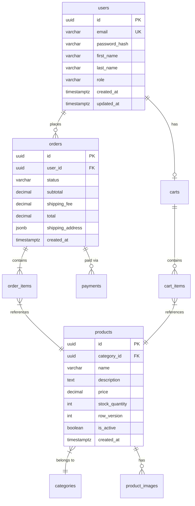

# Database Schema — TechShop Online Store
**Version:** 1.0 | **Date:** 2026-03-03 | **Author:** DBA AI

---

## 1. ER Diagram



---

## 2. Normalization Decisions

| Decision | Table | เหตุผล |
|----------|-------|--------|
| Denormalize shipping_address ใน orders | orders.shipping_address (JSONB) | Address ณ เวลาสั่งซื้อต้องไม่เปลี่ยนแม้ user แก้ address ทีหลัง — snapshot pattern |
| เก็บ price ใน order_items | order_items.unit_price | ราคาสินค้าอาจเปลี่ยนในอนาคต — ต้องการ historical accuracy |
| ไม่ normalize product specs | products.specs (JSONB) | Specs แตกต่างกันตาม category — flexible schema ดีกว่า EAV pattern |

---

## 3. Table Definitions

### users
| Column | Type | Constraint | Description |
|--------|------|------------|-------------|
| id | UUID | PK, DEFAULT gen_random_uuid() | User identifier |
| email | VARCHAR(255) | UNIQUE NOT NULL | Login email |
| password_hash | VARCHAR(255) | NOT NULL | bcrypt hash (cost 12) |
| first_name | VARCHAR(100) | NOT NULL | ชื่อ |
| last_name | VARCHAR(100) | NOT NULL | นามสกุล |
| role | VARCHAR(20) | NOT NULL DEFAULT 'customer' | 'customer' or 'admin' |
| is_active | BOOLEAN | NOT NULL DEFAULT true | Soft delete |
| created_at | TIMESTAMPTZ | NOT NULL DEFAULT NOW() | สร้างเมื่อ |
| updated_at | TIMESTAMPTZ | NOT NULL DEFAULT NOW() | แก้ล่าสุด |

### products
| Column | Type | Constraint | Description |
|--------|------|------------|-------------|
| id | UUID | PK | Product identifier |
| category_id | UUID | FK → categories.id NOT NULL | หมวดหมู่ |
| name | VARCHAR(255) | NOT NULL | ชื่อสินค้า |
| description | TEXT | | รายละเอียด |
| price | DECIMAL(12,2) | NOT NULL CHECK (price > 0) | ราคา (THB) |
| stock_quantity | INTEGER | NOT NULL DEFAULT 0 CHECK (stock_quantity >= 0) | จำนวนคงเหลือ |
| row_version | INTEGER | NOT NULL DEFAULT 0 | Optimistic concurrency token |
| specs | JSONB | | Specifications (flexible schema) |
| is_active | BOOLEAN | NOT NULL DEFAULT true | Active listing |
| created_at | TIMESTAMPTZ | NOT NULL DEFAULT NOW() | |

### orders
| Column | Type | Constraint | Description |
|--------|------|------------|-------------|
| id | UUID | PK | Order identifier |
| user_id | UUID | FK → users.id NOT NULL | ลูกค้า |
| status | VARCHAR(20) | NOT NULL DEFAULT 'pending' | pending/processing/shipped/delivered/cancelled |
| subtotal | DECIMAL(12,2) | NOT NULL | ราคาสินค้ารวม |
| shipping_fee | DECIMAL(12,2) | NOT NULL DEFAULT 0 | ค่าส่ง |
| total | DECIMAL(12,2) | NOT NULL | ยอดรวม = subtotal + shipping_fee |
| shipping_address | JSONB | NOT NULL | Snapshot ที่อยู่ ณ เวลาสั่งซื้อ |
| created_at | TIMESTAMPTZ | NOT NULL DEFAULT NOW() | |

### order_items
| Column | Type | Constraint | Description |
|--------|------|------------|-------------|
| id | UUID | PK | |
| order_id | UUID | FK → orders.id NOT NULL | |
| product_id | UUID | FK → products.id NOT NULL | |
| quantity | INTEGER | NOT NULL CHECK (quantity > 0) | จำนวน |
| unit_price | DECIMAL(12,2) | NOT NULL | ราคา ณ เวลาซื้อ (snapshot) |

### payments
| Column | Type | Constraint | Description |
|--------|------|------------|-------------|
| id | UUID | PK | |
| order_id | UUID | FK → orders.id NOT NULL | |
| provider | VARCHAR(20) | NOT NULL | 'stripe' or 'promptpay' |
| provider_ref | VARCHAR(255) | UNIQUE NOT NULL | Stripe payment_intent_id หรือ PromptPay ref |
| amount | DECIMAL(12,2) | NOT NULL | จำนวนเงิน |
| status | VARCHAR(20) | NOT NULL | pending/completed/failed/refunded |
| paid_at | TIMESTAMPTZ | | เวลาจ่ายสำเร็จ |
| created_at | TIMESTAMPTZ | NOT NULL DEFAULT NOW() | |

### cart_items
| Column | Type | Constraint | Description |
|--------|------|------------|-------------|
| id | UUID | PK | |
| cart_id | UUID | FK → carts.id NOT NULL | |
| product_id | UUID | FK → products.id NOT NULL | |
| quantity | INTEGER | NOT NULL DEFAULT 1 CHECK (quantity > 0) | จำนวน |
| added_at | TIMESTAMPTZ | NOT NULL DEFAULT NOW() | |

---

## 4. Indexing Strategy

| Table | Index | Type | เหตุผล |
|-------|-------|------|--------|
| users | email | UNIQUE BTREE | Login lookup — frequent |
| products | category_id | BTREE | Filter by category |
| products | (price, id) | BTREE | Sort by price with pagination |
| products | name gin_trgm | GIN + pg_trgm | Full-text search |
| products | is_active (partial) | PARTIAL `WHERE is_active = true` | Active products only |
| orders | user_id | BTREE | Order history lookup |
| orders | status | BTREE | Admin: filter by status |
| order_items | order_id | BTREE | Cascade load order items |
| cart_items | (cart_id, product_id) | UNIQUE BTREE | Prevent duplicate items |
| payments | provider_ref | UNIQUE BTREE | Webhook deduplication |

---

## 5. DB Security Design

### Database Users & Permissions
| User | Role | Permissions |
|------|------|------------|
| techshop_app | Application | SELECT, INSERT, UPDATE, DELETE on all tables |
| techshop_readonly | Reporting | SELECT only on all tables |
| techshop_migration | CI/CD migrations | DDL (CREATE, ALTER, DROP) |

### Sensitive Data Handling
- `users.password_hash`: bcrypt cost 12, ไม่เคย log
- `payments.provider_ref`: ไม่เคย log ใน application logs
- PII fields (email, name, address): ไม่ expose ใน error messages

---

## 6. Key Migration

```sql
-- Migration: 20260301_create_products_table.sql
CREATE TABLE products (
    id UUID PRIMARY KEY DEFAULT gen_random_uuid(),
    category_id UUID NOT NULL REFERENCES categories(id),
    name VARCHAR(255) NOT NULL,
    description TEXT,
    price DECIMAL(12,2) NOT NULL CHECK (price > 0),
    stock_quantity INTEGER NOT NULL DEFAULT 0 CHECK (stock_quantity >= 0),
    row_version INTEGER NOT NULL DEFAULT 0,
    specs JSONB,
    is_active BOOLEAN NOT NULL DEFAULT true,
    created_at TIMESTAMPTZ NOT NULL DEFAULT NOW()
);

-- Partial index สำหรับ active products เท่านั้น
CREATE INDEX idx_products_active ON products(id) WHERE is_active = true;

-- GIN index สำหรับ full-text search
CREATE EXTENSION IF NOT EXISTS pg_trgm;
CREATE INDEX idx_products_name_search ON products USING GIN (name gin_trgm_ops);
```

---

## Handoff Digest → Role 3: UX/UI Designer

**Status:** READY

**Critical Items for Next Role:**
- Entities หลัก: 7 tables — users, products, categories, cart/cart_items, orders/order_items, payments
- Product search: Full-text search พร้อม (GIN index) — สามารถออกแบบ real-time search UX ได้
- Stock: มี `stock_quantity` — UI ต้องแสดง "สินค้าหมด" state ได้
- Order status flow: pending → processing → shipped → delivered → cancelled

**Key Deliverables Created:**
- `templates/11-dba/db-schema.md` ✅
