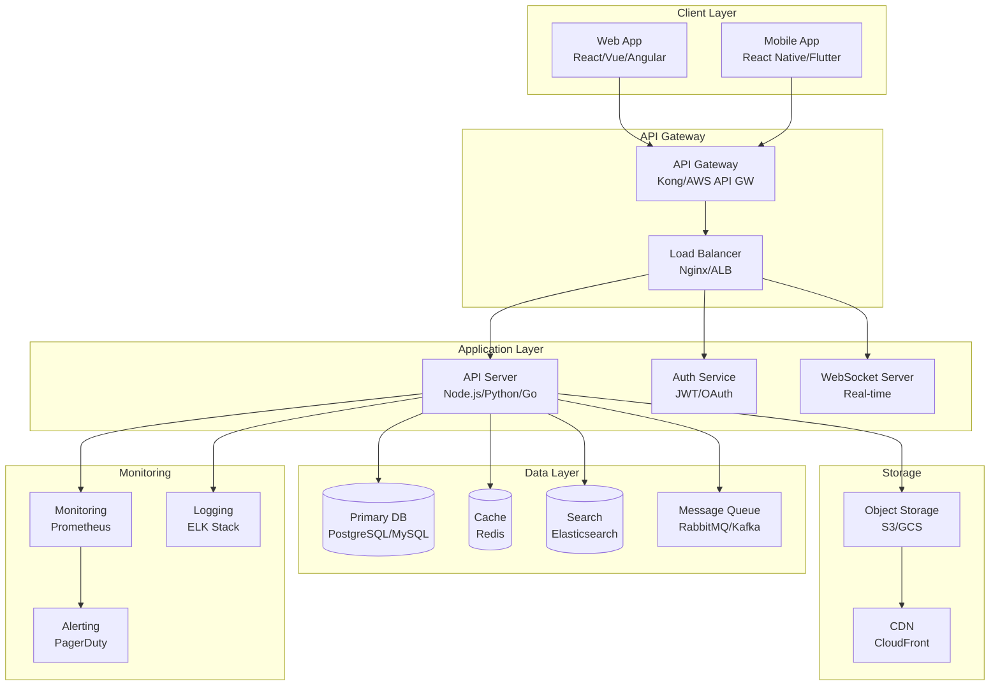
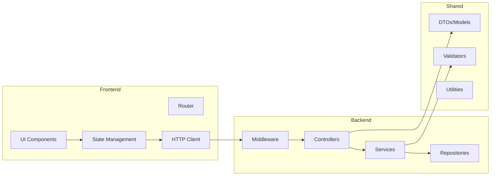

# Architecture Diagram

## Project: [SYSTEM_NAME]

---

## High-Level Architecture



## Component Diagram



## Infrastructure Diagram

```
┌─────────────────────────────────────────────────────┐
│                    Cloud Provider                     │
│  ┌─────────────────────────────────────────────────┐ │
│  │                    VPC                           │ │
│  │  ┌──────────┐  ┌──────────┐  ┌──────────────┐  │ │
│  │  │ Public   │  │ Private  │  │ Database     │  │ │
│  │  │ Subnet   │  │ Subnet   │  │ Subnet       │  │ │
│  │  │          │  │          │  │              │  │ │
│  │  │ [LB]     │  │ [App]    │  │ [DB Primary] │  │ │
│  │  │ [NAT GW] │  │ [App]    │  │ [DB Replica] │  │ │
│  │  │ [Bastion]│  │ [Worker] │  │ [Redis]      │  │ │
│  │  └──────────┘  └──────────┘  └──────────────┘  │ │
│  └─────────────────────────────────────────────────┘ │
│                                                       │
│  [S3] [CloudFront] [Route53] [ACM]                   │
└─────────────────────────────────────────────────────┘
```

## Decision Records

| Decision | Options Considered | Chosen | Reason |
|----------|-------------------|--------|--------|
| Architecture Style | Monolith, Microservices, Modular Monolith | [chosen] | [reason] |
| Communication | REST, GraphQL, gRPC | [chosen] | [reason] |
| Database | SQL vs NoSQL | [chosen] | [reason] |
