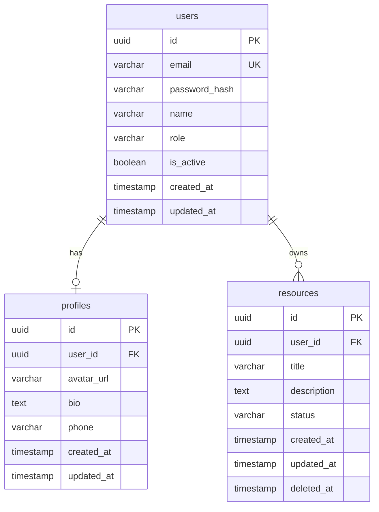

# Database Schema

## Project: [SYSTEM_NAME]
**Database**: [PostgreSQL/MySQL/MongoDB]
**Version**: [X.X]

---

## ER Diagram



## Table Definitions

### Table: users

| Column | Type | Constraints | Default | Description |
|--------|------|-------------|---------|-------------|
| id | UUID | PK, NOT NULL | gen_random_uuid() | Primary key |
| email | VARCHAR(255) | UNIQUE, NOT NULL | - | User email |
| password_hash | VARCHAR(255) | NOT NULL | - | Bcrypt hashed password |
| name | VARCHAR(100) | NOT NULL | - | Display name |
| role | VARCHAR(20) | NOT NULL | 'user' | user/admin/moderator |
| is_active | BOOLEAN | NOT NULL | true | Account status |
| created_at | TIMESTAMP | NOT NULL | NOW() | Creation timestamp |
| updated_at | TIMESTAMP | NOT NULL | NOW() | Last update timestamp |

**Indexes:**
| Name | Columns | Type | Purpose |
|------|---------|------|---------|
| idx_users_email | email | UNIQUE | Login lookup |
| idx_users_role | role | BTREE | Role-based queries |
| idx_users_created | created_at | BTREE | Sorting |

---

### Table: [TABLE_NAME]

| Column | Type | Constraints | Default | Description |
|--------|------|-------------|---------|-------------|
| id | UUID | PK, NOT NULL | gen_random_uuid() | |
| | | | | |

**Indexes:**
| Name | Columns | Type | Purpose |
|------|---------|------|---------|
| | | | |

**Foreign Keys:**
| Column | References | On Delete | On Update |
|--------|-----------|-----------|-----------|
| user_id | users(id) | CASCADE | CASCADE |

---

## Migration Strategy

| Version | Description | Up Script | Down Script |
|---------|-------------|-----------|-------------|
| 001 | Create users table | CREATE TABLE users... | DROP TABLE users |
| 002 | Create profiles table | CREATE TABLE profiles... | DROP TABLE profiles |
| 003 | Add index on email | CREATE INDEX... | DROP INDEX... |

## Seed Data

```sql
-- Development seed data
INSERT INTO users (id, email, password_hash, name, role) VALUES
  ('uuid-1', 'admin@example.com', '$2b$...', 'Admin User', 'admin'),
  ('uuid-2', 'user@example.com', '$2b$...', 'Test User', 'user');
```

## Performance Considerations

- [ ] Indexes cover all frequent query patterns
- [ ] No N+1 query risks identified
- [ ] Pagination implemented for list queries
- [ ] Soft delete used where appropriate
- [ ] Proper data types (avoid VARCHAR for everything)
- [ ] Considered partitioning for large tables
