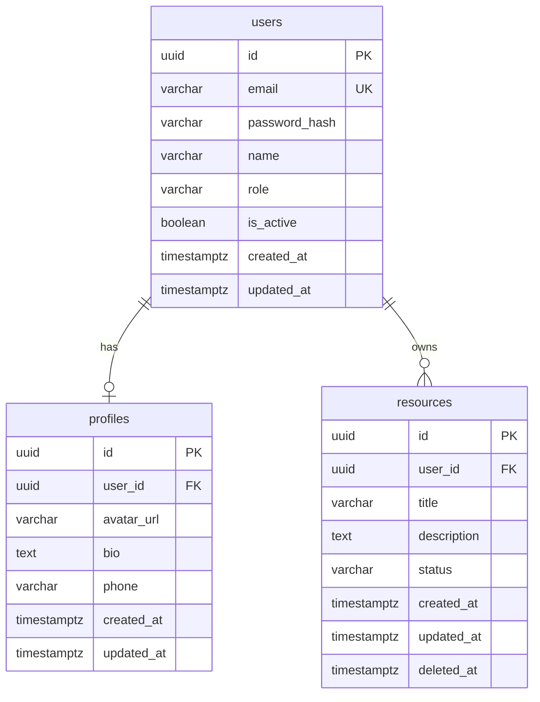

# Database Schema

## Project: [SYSTEM_NAME]
**Database Engine**: [PostgreSQL/MySQL/MongoDB]
**Version**: [X.X]
**Designed by**: DBA (Role 11)
**Last Updated**: [TIMESTAMP]

---

## 1. ER Diagram



---

## 2. Normalization Decisions

> Document ทุก Denormalization decision — Developer ต้องเข้าใจว่าทำไมจึงไม่ Normalize

| Table | Column | Denormalized จาก | เหตุผล |
|-------|--------|-----------------|-------|
| [table] | [column] | [source table.column] | [เหตุผลทางธุรกิจ เช่น "snapshot ราคา ณ เวลาสั่งซื้อ"] |

---

## 3. Table Definitions

### Table: users

| Column | Type | Constraints | Default | Description |
|--------|------|-------------|---------|-------------|
| id | UUID | PK, NOT NULL | gen_random_uuid() | Primary key |
| email | VARCHAR(255) | UNIQUE, NOT NULL | — | User email สำหรับ login |
| password_hash | VARCHAR(255) | NOT NULL | — | Bcrypt hashed password (cost ≥ 12) |
| name | VARCHAR(100) | NOT NULL | — | Display name |
| role | VARCHAR(20) | NOT NULL | 'user' | user / admin / moderator |
| is_active | BOOLEAN | NOT NULL | true | Account status — false = soft disabled |
| created_at | TIMESTAMPTZ | NOT NULL | NOW() | Creation timestamp (with timezone) |
| updated_at | TIMESTAMPTZ | NOT NULL | NOW() | Last update timestamp |

**Indexes:**
| Name | Columns | Type | Purpose / API Endpoint |
|------|---------|------|----------------------|
| idx_users_email | email | UNIQUE B-Tree | Login: `POST /auth/login` |
| idx_users_role | role | B-Tree | Role-based filtering: `GET /admin/users` |

**Foreign Keys:** — (root table, no FK)

---

### Table: [TABLE_NAME]

| Column | Type | Constraints | Default | Description |
|--------|------|-------------|---------|-------------|
| id | UUID | PK, NOT NULL | gen_random_uuid() | Primary key |
| user_id | UUID | FK, NOT NULL | — | Owner reference |
| | | | | |

**Indexes:**
| Name | Columns | Type | Purpose / API Endpoint |
|------|---------|------|----------------------|
| idx_[table]_user_id | user_id | B-Tree | User's [resource] list |

**Foreign Keys:**
| Column | References | On Delete | On Update | เหตุผล |
|--------|-----------|-----------|-----------|-------|
| user_id | users(id) | CASCADE | CASCADE | ลบ user → ลบ data ของ user ทั้งหมด |

---

## 4. Indexing & Performance Strategy

### Index Summary

| Index Name | Table | Columns | Type | Purpose |
|-----------|-------|---------|------|---------|
| [name] | [table] | [cols] | [B-Tree/GIN/Hash] | [API endpoint หรือ query pattern] |

### Query Performance Notes

- **Hot Queries** (ต้องการ index แน่ๆ): [list endpoints ที่เรียกบ่อยที่สุด]
- **N+1 Risk Tables**: [tables ที่มักถูก query ซ้ำๆ ใน loop — ควรใช้ JOIN หรือ Include]
- **Large Tables** (> 1M rows คาดการณ์): [tables ที่ควรพิจารณา Partitioning]

---

## 5. Foreign Key & Integrity Rules

| FK Column | Table | References | On Delete | On Update | เหตุผล |
|-----------|-------|-----------|-----------|-----------|-------|
| user_id | profiles | users(id) | CASCADE | CASCADE | Profile เป็น extension ของ User |
| user_id | resources | users(id) | CASCADE | CASCADE | Resource เป็น owned data |

**Check Constraints:**
```sql
-- ตัวอย่าง: ป้องกัน invalid data ระดับ DB
ALTER TABLE resources ADD CONSTRAINT chk_status
  CHECK (status IN ('draft', 'published', 'archived'));
```

---

## 6. DB Security Design

### DB Users & Permissions

| DB User | Permissions | ใช้โดย | หมายเหตุ |
|---------|------------|-------|---------|
| app_user | SELECT, INSERT, UPDATE, DELETE | Application server | ห้าม DDL (DROP/ALTER) |
| app_readonly | SELECT only | Reporting, analytics | Read-only queries |
| migration_user | ALL (DDL included) | Migration scripts only | ใช้เฉพาะตอน deploy |

```sql
-- สร้าง DB users
CREATE ROLE app_user LOGIN PASSWORD '[use env var]';
GRANT SELECT, INSERT, UPDATE, DELETE ON ALL TABLES IN SCHEMA public TO app_user;
GRANT USAGE ON ALL SEQUENCES IN SCHEMA public TO app_user;

CREATE ROLE app_readonly LOGIN PASSWORD '[use env var]';
GRANT SELECT ON ALL TABLES IN SCHEMA public TO app_readonly;
```

### Sensitive Data & Encryption

| Column | Table | ประเภท Sensitive Data | Encryption Method |
|--------|-------|---------------------|-----------------|
| password_hash | users | Credentials | Bcrypt (cost ≥ 12) |
| [column] | [table] | PII / Payment | [pgcrypto / app-level AES-256] |

**Connection Security:**
- SSL/TLS: บังคับ `sslmode=require` สำหรับ production
- Connection pooling: ใช้ PgBouncer / connection pool ใน app

### Row-Level Security (ถ้าใช้ multi-tenant)

```sql
-- เปิดใช้ RLS
ALTER TABLE [table] ENABLE ROW LEVEL SECURITY;

-- Policy ตัวอย่าง: user เห็นเฉพาะ data ของตัวเอง
CREATE POLICY user_owns_data ON [table]
  USING (user_id = current_setting('app.current_user_id')::uuid);
```

---

## 7. Migration Plan

### Migration Sequence

| Version | File | Description | Depends On |
|---------|------|-------------|-----------|
| 001 | `20240115_001_create_users.sql` | Create users table | — |
| 002 | `20240115_002_create_profiles.sql` | Create profiles table | 001 |
| 003 | `20240115_003_create_resources.sql` | Create resources table | 001 |

### Migration Template

```sql
-- migrations/[TIMESTAMP]_[NNN]_[description].sql

-- ============================================================
-- Up Migration
-- ============================================================
CREATE TABLE [table_name] (
  id          UUID PRIMARY KEY DEFAULT gen_random_uuid(),
  [columns...]
  created_at  TIMESTAMPTZ NOT NULL DEFAULT NOW(),
  updated_at  TIMESTAMPTZ NOT NULL DEFAULT NOW()
);

-- Indexes
CREATE INDEX idx_[table]_[col] ON [table_name]([column]);

-- ============================================================
-- Down Migration (Rollback)
-- ============================================================
DROP INDEX IF EXISTS idx_[table]_[col];
DROP TABLE IF EXISTS [table_name];
```

### Seed Data (Development)

```sql
-- seeds/dev_seed.sql — Development environment only (ห้ามรันใน production)
INSERT INTO users (id, email, password_hash, name, role) VALUES
  ('00000000-0000-0000-0000-000000000001', 'admin@dev.local', '$2b$12$...', 'Admin Dev', 'admin'),
  ('00000000-0000-0000-0000-000000000002', 'user@dev.local',  '$2b$12$...', 'Test User', 'user');
```

---

## 8. Backup & Recovery Plan

| Item | Strategy | รายละเอียด |
|------|---------|-----------|
| **Backup Frequency** | [Daily full / Hourly incremental] | [เช่น pg_dump daily + WAL archiving] |
| **Retention Policy** | [X days / X weeks] | [เช่น 7 daily, 4 weekly, 3 monthly] |
| **Point-in-Time Recovery** | [Enable/Disable] | [WAL archiving สำหรับ PostgreSQL] |
| **Backup Storage** | [Location] | [เช่น S3 bucket ใน different region] |
| **Recovery Time Objective (RTO)** | [X hours] | เป้าหมายเวลาที่ระบบกลับมาใช้งาน |
| **Recovery Point Objective (RPO)** | [X minutes] | ข้อมูลที่ยอมรับการสูญเสียได้สูงสุด |

### Recovery Test Checklist
- [ ] ทดสอบ restore จาก backup ทุก [X weeks]
- [ ] ตรวจสอบ backup integrity (checksum)
- [ ] Document ขั้นตอน restore ใน Runbook

---

## 9. Performance Considerations

- [ ] Indexes ครอบคลุม query patterns หลักทั้งหมด
- [ ] ไม่มี N+1 query risks ที่ยังไม่ได้แก้
- [ ] Pagination ใช้ cursor-based สำหรับ large datasets (ไม่ใช่ OFFSET)
- [ ] Soft delete ใช้ `deleted_at` แทนการลบจริง (สำหรับ tables ที่ระบุ)
- [ ] Data types เหมาะสม (ไม่ใช้ VARCHAR สำหรับทุกอย่าง)
- [ ] Tables ที่คาดว่า > 1M rows มีแผน Partitioning
