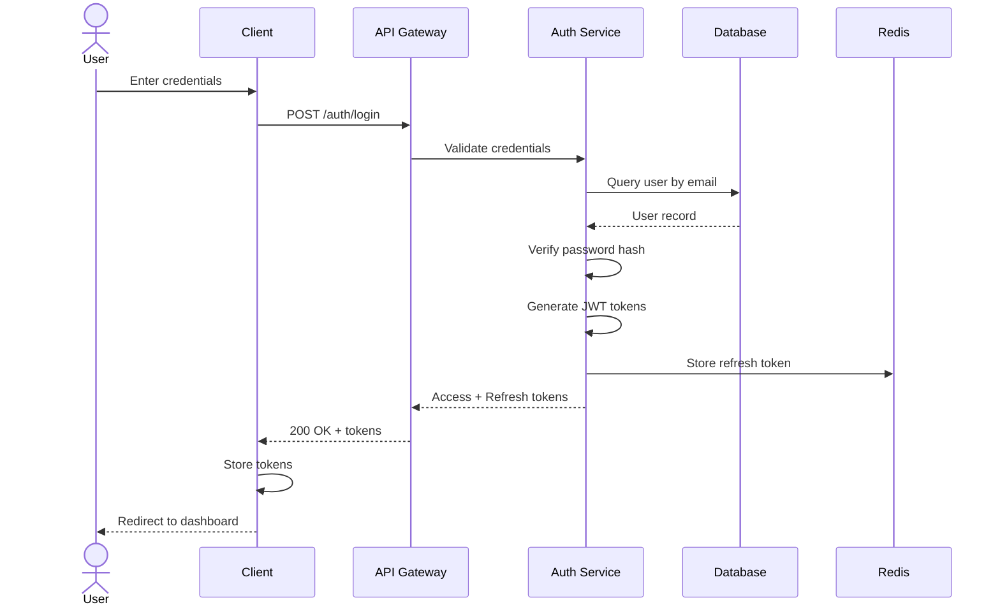
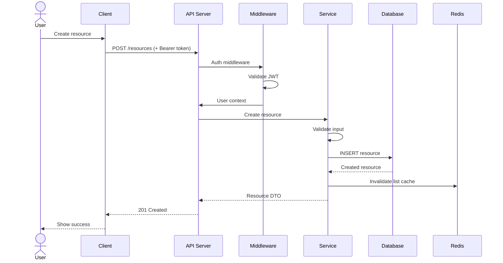
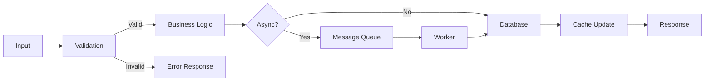
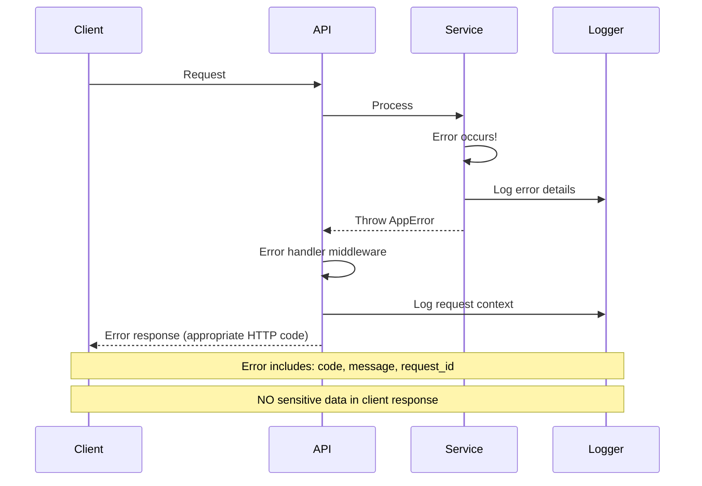
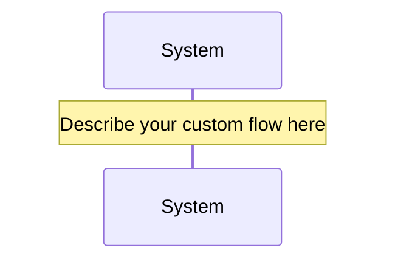

# Data Flow & Sequence Diagrams

## Project: [SYSTEM_NAME]

---

## 1. Authentication Flow

## 2. CRUD Operation Flow

## 3. Data Processing Flow

## 4. Error Handling Flow

## 5. [Custom Flow: FLOW_NAME]

---

## Data Transformation Points

| Point | Input Format | Output Format | Transformation |
|-------|-------------|---------------|----------------|
| API Input | JSON (client) | DTO | Validation + Sanitization |
| Service Layer | DTO | Entity | Business logic |
| Repository | Entity | SQL | ORM mapping |
| API Output | Entity | Response DTO | Field selection + formatting |
